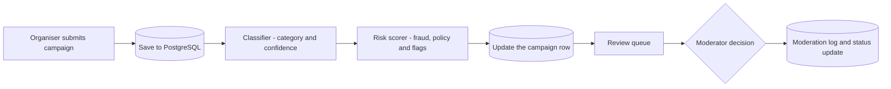
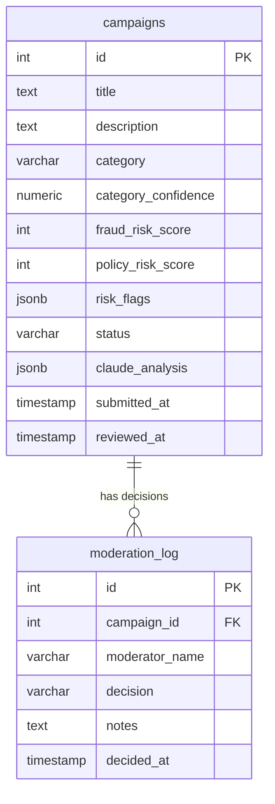

# Mizan
### *Campaign intake intelligence for trust and safety teams.*


**Mizan** is a full-stack web application that helps a moderation team review crowdfunding campaigns faster and more consistently.
Each submission is read by an AI assistant, classified by Islamic giving type (Zakat, Sadaqah, Waqf or Lillah) and scored separately for **fraud risk** and **policy risk**.
Nothing goes live on the AI's say-so: a human moderator approves, rejects or escalates every campaign, and every decision is recorded permanently.
Moderators can also ask questions in plain English to find past campaigns they cannot remember exactly.

Mizan was built as a portfolio project, modelled on the trust-and-safety needs of a faith-based crowdfunding platform.
It is an independent project and is **not affiliated with, or endorsed by, any organisation**.

**Live demo:** [mizan.skcbuilds.uk](https://mizan.skcbuilds.uk)
**Repository:** [github.com/Sangima-Chowdhury/mizan](https://github.com/Sangima-Chowdhury/mizan)

> The live demo is open, uses demo data and has no login. Please do not enter real personal information.

> **TODO:** check that the repository link above opens your real `mizan` repo.

---

## Table of Contents

1. [Introduction](#mizan)
2. [UX and Project Goals](#2-ux-and-project-goals)
3. [User Stories](#3-user-stories)
4. [Screenshots and User Story Alignment](#4-screenshots-and-user-story-alignment)
5. [Design Decisions and Justifications](#5-design-decisions-and-justifications)
6. [UI and Visual Style Guide](#6-ui-and-visual-style-guide)
7. [Architecture and Data Model](#7-architecture-and-data-model)
8. [Features](#8-features)
9. [Security](#9-security)
10. [Technologies Used](#10-technologies-used)
11. [Development Process](#11-development-process)
12. [Testing](#12-testing)
13. [Deployment](#13-deployment)
14. [Credits](#14-credits)

---

## 2. UX and Project Goals

### Project Goals
The goal of Mizan is to give a trust-and-safety team a fast, fair and accountable way to triage crowdfunding campaigns.
It aims to:

- read every submission before a human does, and give the moderator a category, a confidence level and two separate risk scores
- keep the human in charge: the AI proposes, the moderator decides
- keep a permanent record of who decided what, and why
- make old campaigns easy to find without remembering exact titles or dates

### Value to Users
- **Moderators** spend less time on first-pass sorting and see the reasons for a risk score (short flags such as "vague beneficiary details") instead of a bare number.
- **Trust-and-safety leads** get a consistent process and a permanent audit trail.
- **Campaign organisers** receive immediate confirmation that their campaign has been received and is awaiting review.

### Target Audience
- Primary: campaign moderators on a charitable crowdfunding platform.
- Secondary: trust-and-safety leads, and campaign organisers submitting campaigns.

### Moderator Goals
- See the newest information first, with the riskiest details easy to spot.
- Trust that a failure in the AI never hides a campaign or lets one through unchecked.
- Record a decision in a few clicks, with a note explaining the reasoning.
- Find an earlier campaign by asking a question in natural language.

### Campaign Organiser Goals
- Submit a campaign with a title and a description.
- Get clear feedback that the submission worked, or a clear message if it did not.

### Business and Developer Goals
- Demonstrate a full-stack Python application with a relational database and a safe use of an AI API.
- Keep secrets out of the repository and out of the browser.
- Document design decisions, testing and known limitations honestly.
- Build a portfolio-ready project that can be deployed to a cloud platform.

---

## 3. User Stories

### Moderator and Organiser Stories

---

#### 1. Submit a Campaign
**As a campaign organiser**, I want to submit my campaign with a title and description, so that it can be reviewed.

**Acceptance Criteria:**
- Title and description are both required.
- A clear message appears if either field is missing.
- After submission, a confirmation panel shows that the campaign is pending human review.

**Tasks:**
- Build the submission form with required fields.
- Validate the fields on the server as well as in the browser.
- Show a result panel with the outcome or a readable error.

**Priority:** High

---

#### 2. Automatic Categorisation
**As a moderator**, I want each campaign to be classified into a giving category, so that I can review campaigns with the right rules in mind.

**Acceptance Criteria:**
- Every campaign receives exactly one of five categories: Zakat, Sadaqah, Waqf, Lillah or Uncategorized.
- A confidence value from 0 to 100 is stored with the category.
- Ambiguous campaigns are marked Uncategorized instead of guessed.

**Tasks:**
- Write the classification prompt, including the difference between Sadaqah Jariyah and Waqf.
- Parse the model's JSON reply safely.
- Fall back to Uncategorized with confidence 0 if the call or the parsing fails.

**Priority:** High

---

#### 3. Risk Assessment That Fails Safe
**As a moderator**, I want separate fraud and policy risk scores with short reasons, so that I know where to look first.

**Acceptance Criteria:**
- Fraud risk and policy risk are scored independently from 0 to 100.
- Specific risk flags are listed (for example "vague beneficiary details").
- If the assessment fails or cannot be read, both scores default to 100 so that a human looks closely.

**Tasks:**
- Write the risk-assessment prompt with separate criteria for fraud and policy.
- Store the scores and flags in the database.
- Add the fail-safe default and a failure flag.

**Priority:** High

---

#### 4. A Prioritised Review Queue
**As a moderator**, I want to see all campaigns waiting for review, oldest first, with summary statistics.

**Acceptance Criteria:**
- Only campaigns with the status "pending review" are shown.
- The queue shows the number pending and the average fraud and policy risk.
- Each campaign can be expanded to show the full description, risk gauges and flags.
- Loading, empty and error states are clearly worded.

**Tasks:**
- Build the queue endpoint and the queue view.
- Colour the risk gauges by band (low, medium, high).
- Add the balance-scale graphic that tilts with the queue's average risks.

**Priority:** High

---

#### 5. Accountable Decisions
**As a moderator**, I want to approve, reject or escalate a campaign and record my name and reasoning, so that decisions can be traced.

**Acceptance Criteria:**
- A moderator name and a decision are required; notes are optional.
- Only the three valid decisions are accepted.
- The campaign leaves the queue as soon as a decision is saved.

**Tasks:**
- Build the decision form and the three colour-coded buttons.
- Write to the moderation log and update the campaign's status.
- Show a clear message if saving fails.

**Priority:** High

---

### Site Owner Stories

---

#### 6. A Permanent Audit Trail
**As a trust-and-safety lead**, I want a permanent history of decisions, so that I can see who decided what and why.

**Acceptance Criteria:**
- Each decision shows the campaign, category, risk scores, moderator, decision, notes and time.
- Decisions are only ever added, never edited or removed through the application.

**Tasks:**
- Create a separate moderation log table linked to campaigns.
- Build the history view showing the latest 50 decisions.

**Priority:** High

---

#### 7. Find Past Campaigns in Plain English
**As a moderator**, I want to ask "show me high-risk medical campaigns from last month", so that I can find a campaign without remembering its exact details.

**Acceptance Criteria:**
- The assistant answers only from real database results.
- The answer names specific campaign titles, IDs and statuses.
- The page shows which filters were used and how many results were found.

**Tasks:**
- Define a search tool with structured filters.
- Run the search with parameterised SQL.
- Show the answer, the filters and the result count.

**Priority:** Medium

---

#### 8. Safe Handling of Secrets
**As the developer**, I want API keys and database credentials kept out of the code and the repository, so that the project can be shared and deployed safely.

**Acceptance Criteria:**
- Secrets are read from environment variables.
- The `.env` file is ignored by git.
- An `.env.example` file documents the variables without real values.

**Tasks:**
- Add `.env` to `.gitignore`.
- Create `.env.example`.
- Check tracked files with `git ls-files` before pushing.

**Priority:** High

---

#### 9. Documented for Assessment and Portfolio
**As the developer**, I want clear documentation of purpose, decisions, testing and deployment, so that others can understand, run and assess the project.

**Tasks:**
- Write this README, including honest known limitations.
- Keep a bug log and a test matrix.
- Commit in small, well-described steps.

**Priority:** Medium

---

### Summary Table

| # | User Story Summary | Priority |
|---|--------------------|----------|
| 1 | Submit a campaign | High |
| 2 | Automatic categorisation | High |
| 3 | Risk assessment that fails safe | High |
| 4 | Prioritised review queue | High |
| 5 | Accountable decisions | High |
| 6 | Permanent audit trail | High |
| 7 | Find past campaigns in plain English | Medium |
| 8 | Safe handling of secrets | High |
| 9 | Documented for assessment and portfolio | Medium |

---

## 4. Screenshots and User Story Alignment

> **TODO:** save your screenshots in `docs/screenshots/` using the lowercase filenames below. Remove any TODO note once its screenshot is added.

### User Story 1: Submit a Campaign
The Submit Campaign tab shows a short form with two required fields and one clear button.


> **TODO:** add `submit-result.png`, a screenshot of the result panel after a successful submission (category, confidence, both risk gauges and flags).

### User Stories 4 and 5: Review Queue and Decisions
The Review Queue tab shows the pending count, the average fraud and policy risk, and a card for each campaign.


> **TODO:** add `decision-form.png`, a screenshot of an expanded card showing the gauges, flags and the Approve, Escalate and Reject buttons.

### User Story 6: Audit Trail
The History tab lists past decisions with the reviewer, the decision and any notes.


### User Story 7: Ask Mizan
The Ask Mizan tab answers a plain-English question and shows which filters were used and how many results were found.


---

## 5. Design Decisions and Justifications

Each decision below records what was chosen, what else was considered, why, and what it costs.

### 1. The AI proposes, a human decides
- **Alternatives:** automatically approve low-risk campaigns.
- **Reason:** decisions about fraud and policy affect real donors and real people, and an AI can be confidently wrong.
- **Trade-off:** every campaign needs moderator time.

### 2. Save the submission before calling the AI
- **Alternatives:** call the AI first and save afterwards.
- **Reason:** a submission must never be lost because an external API is slow or down.
- **Trade-off:** for a brief moment a campaign exists without a category or scores. The interface handles missing values.

### 3. Fail safe, not fail open
- **Alternatives:** score a failed assessment as 0 (low risk), or retry silently.
- **Reason:** if the assessment cannot be read, the safest assumption is that the campaign needs close human attention. Failed risk assessments default to 100 for both scores, and a failed classification becomes "uncategorized".
- **Trade-off:** failures make the queue look riskier than it is, which can inflate the averages.

### 4. Two separate risk scores
- **Alternatives:** one combined risk score.
- **Reason:** fraud and policy problems need different responses. A vague but clearly charitable campaign is a fraud concern but not a policy one, and a well-documented non-charitable request is the reverse.
- **Trade-off:** two numbers to read instead of one.

### 5. Domain rules in the classifier
- **Decision:** Waqf is reserved for formally structured, managed endowments. One-off acts with a lasting effect (Sadaqah Jariyah), such as planting olive trees, stay under Sadaqah.
- **Reason:** it matches how the categories are understood and avoids overusing the Waqf label.
- **Trade-off:** borderline campaigns are more likely to end up as Sadaqah or Uncategorized, and a moderator makes the final call.

### 6. A structured search tool, not AI-written SQL
- **Alternatives:** let the model write SQL directly.
- **Reason:** the model's output is treated as untrusted input. It can only choose from six filters (category, status, keyword, minimum fraud risk, and a date range), and every value reaches the database as a parameter.
- **Trade-off:** it cannot answer every question, for example counts per month.

### 7. One search per question, capped at 20 results
- **Reason:** predictable cost and speed, and answers stay within the space the model is given.
- **Trade-off:** with more than 20 matches, older results are not shown.

### 8. An append-only decision log
- **Decision:** the moderation log links to campaigns with `ON DELETE RESTRICT`, and the application only ever adds rows.
- **Reason:** accountability.
- **Trade-off:** a real deployment would need a retention and erasure policy.

### 9. Rules enforced in the database as well as in Python
- **Decision:** `CHECK` constraints limit categories, statuses, decisions and scores.
- **Reason:** bad data is rejected even if a bug gets past the application code.

### 10. A single-file dashboard with plain HTML, CSS and JavaScript
- **Alternatives:** a JavaScript framework, or Flask templates for every view.
- **Reason:** a small project needs no build step.
- **Trade-off:** harder to maintain than separate files, and it does not use Flask template features. See the deviations below.

### Deliberate Deviations from Good Practice
These choices go against accepted UX, accessibility or security practice. They are recorded here so that they are visible decisions, not oversights.

| Deviation | Why it was accepted | What would fix it |
|-----------|---------------------|-------------------|
| Risk scores and flags are shown to the person submitting a campaign | Useful for demonstrating the analysis | Show organisers only a plain confirmation and keep scores staff-only |
| Tabs switch without changing the web address, so the browser Back button leaves the app | Keeps the demo to a single page | Give each view its own URL or hash |
| No login, so anyone can review campaigns | The project is a demo with sample data | Add staff authentication and roles |
| A browser `alert()` appears if a decision fails to save | Quick and unmistakable | Show an inline message beside the buttons |
| White text on the brass accent colour may not meet contrast guidelines | Chosen for the visual identity | Darken the accent, then re-test |

> **TODO:** check the last row with the WebAIM Contrast Checker and record the actual ratio.

---

## 6. UI and Visual Style Guide

The interface is a custom design built with plain CSS. It uses a warm, paper-like palette and a balance-scale logo that responds to the data.

### Colour System

| Role | Hex | Where it is used |
|------|-----|------------------|
| Page background | `#F8F5EF` | Page background |
| Surface | `#FFFFFF` | Cards, header, form panels |
| Raised surface | `#F1EBDC` | Input fields, navigation tabs |
| Border | `#E6DFCD` | Card and panel borders |
| Text | `#262019` | Body text |
| Dim text | `#7C7566` | Labels, timestamps, hints |
| Ink | `#201B14` | Headings |
| Brass (primary accent) | `#B9873E` | Active tab, primary button, category badge |
| Verdigris | `#4F8A67` | Approved, low risk |
| Rust | `#B14A32` | Rejected, high risk |
| Plum | `#7A5F92` | Escalated |

Risk gauges change colour by score: 0 to 33 is low (verdigris), 34 to 66 is medium (brass) and 67 to 100 is high (rust).
Colour is never the only signal: every score is also shown as a number and every decision as a word.

### Typography
- **Headings:** Fraunces (serif)
- **Body and interface text:** Public Sans
- **Data, badges and timestamps:** IBM Plex Mono

### Buttons
- **Primary** (`.btn-primary`): brass background with white text, used for Submit and Ask.
- **Decision buttons** (`.btn-decision`): outlined in the decision's colour and filled on hover (Approve in verdigris, Escalate in plum, Reject in rust).
- **Navigation tabs:** the active tab is filled with brass.

### The Balance Scale
The logo in the header is an SVG balance. When the review queue loads, the beam tilts by the difference between the average fraud risk and the average policy risk, divided by six and limited to 12 degrees either way. It sits level when the queue is empty. It is a visual summary of the current queue, not a decision-making tool.

### Accessibility and Responsiveness
- The page declares its language and a mobile viewport.
- Visible focus outlines are provided for keyboard users.
- Animations are turned off for people who prefer reduced motion.
- Text from campaigns is escaped before it is displayed, so submitted text cannot run as code.
- The layout adapts at 640 pixels wide: the statistics stack and the risk gauges sit in a column.

### Design Process
Mizan's interface was designed directly in code in a single build session, so there are no wireframes from before the build.

> **TODO:** if you want design evidence, add wireframes to `docs/wireframes/` and label them clearly as retrospective, or delete this note.

---

## 7. Architecture and Data Model

### How a Campaign Moves Through the System



### Application Routes

| Route | Method | Purpose |
|-------|--------|---------|
| `/` | GET | Serves the dashboard page |
| `/submit` | POST | Saves a campaign, classifies it, scores it and returns the result |
| `/dashboard` | GET | Returns the pending queue as JSON (the page itself is at `/`) |
| `/decide/<id>` | POST | Records a moderator's decision and updates the status |
| `/history` | GET | Returns the latest 50 decisions as JSON |
| `/ask` | POST | Answers a plain-English question using the search tool |

### Project Structure

| File | Responsibility |
|------|----------------|
| `app.py` | Flask application and routes |
| `database.py` | Database connection and table creation |
| `classifier.py` | Category classification prompt and parsing |
| `risk_scorer.py` | Fraud and policy risk prompt and parsing |
| `query_tool.py` | Search tool, SQL builder and assistant |
| `templates/dashboard.html` | The dashboard (HTML, CSS and JavaScript) |
| `requirements.txt` | Pinned dependencies |
| `.env.example` | Names of required environment variables |

### Data Model



**Table: `campaigns`**

| Column | Type | Rules |
|--------|------|-------|
| `id` | serial | Primary key |
| `title` | text | Required |
| `description` | text | Required |
| `category` | varchar(20) | One of zakat, sadaqah, waqf, lillah, uncategorized |
| `category_confidence` | numeric(5,2) | Between 0 and 100 |
| `fraud_risk_score` | integer | Between 0 and 100 |
| `policy_risk_score` | integer | Between 0 and 100 |
| `risk_flags` | jsonb | List of short flag strings |
| `status` | varchar(30) | Required. One of pending_review, approved, rejected, escalated. Defaults to pending_review |
| `claude_analysis` | jsonb | The combined classification and risk analysis as returned |
| `submitted_at` | timestamp | Required. Defaults to now |
| `reviewed_at` | timestamp | Set when a decision is made |

**Table: `moderation_log`**

| Column | Type | Rules |
|--------|------|-------|
| `id` | serial | Primary key |
| `campaign_id` | integer | Required. Foreign key to `campaigns(id)`, `ON DELETE RESTRICT` |
| `moderator_name` | varchar(100) | Required |
| `decision` | varchar(20) | Required. One of approved, rejected, escalated |
| `notes` | text | Optional |
| `decided_at` | timestamp | Required. Defaults to now |

**Relationship:** one campaign can have many log entries. The application currently allows one decision per campaign in normal use, but the database does not enforce this.

Database configuration lives in one place: `database.py` reads `DATABASE_URL` from the environment.

---

## 8. Features

### Existing Features
- Public submission form with required fields
- AI classification into five categories, with a confidence value
- Separate fraud and policy risk scores, with short risk flags
- Fail-safe defaults when the AI call fails or cannot be read
- Review queue, oldest first, with pending count and average risks
- Expandable campaign cards with colour-coded risk gauges
- Approve, reject and escalate decisions with a moderator name and notes
- Permanent decision history, showing the latest 50 decisions
- "Ask Mizan": plain-English search that shows its filters and result count
- Clear loading, empty and error states
- Responsive layout that respects reduced-motion settings

### Features Left to Implement
- Staff login and role-based permissions (the highest priority)
- Hiding risk scores from the person submitting a campaign
- Rate limiting and a spending cap on AI calls
- Refusing decisions on unknown or already-decided campaigns
- Closing database connections safely when an error happens, and connection pooling
- Pagination, so that more than 20 results can be seen
- Automated tests, starting with the SQL builder and the fallback behaviour
- Accessibility improvements (contrast check and form labels inside the queue cards)
- Separate CSS and JavaScript files, and Flask templates for the views

---

## 9. Security

**In place**
- API keys and the database URL are read from environment variables. The `.env` file is ignored by git.
- All database values are passed as parameters, including values chosen by the AI.
- The AI's search tool is limited to fixed filters and cannot run arbitrary SQL.
- Text from campaigns is escaped before display to prevent script injection.
- Database constraints reject invalid categories, statuses, decisions and scores.
- Campaign text is untrusted. The AI must return JSON, unreadable replies fall back to a safe default, and no campaign goes live without a human decision.
- Debug mode is only switched on when running `python app.py` locally. The deployed version runs under gunicorn, which does not run that block.

**Known limitations**
- There is no authentication, so anyone with the address can use the moderation tools and the assistant.
- `/ask` and `/submit` spend API credit and have no rate limit.
- A determined submitter could try to write campaign text that influences the AI. The human decision step limits the harm but does not remove the risk.

> **TODO:** make debug mode depend on an environment variable, then update the first line of the "In place" list.

---

## 10. Technologies Used

- **Python 3** (developed with 3.14) and **Flask** for the web application
- **PostgreSQL** with **psycopg2-binary** for the relational database
- **Anthropic API** (Python SDK) for classification, risk scoring and the search assistant
- **python-dotenv** for local environment variables
- **gunicorn** as the production web server
- **HTML5, CSS3 and JavaScript** for the dashboard
- **Google Fonts** (Fraunces, Public Sans, IBM Plex Mono)
- **Git and GitHub** for version control
- **VS Code** with Pylint and Flake8 for code checking

---

## 11. Development Process

| Stage | What happened |
|-------|---------------|
| Plan | Chose the problem (moderator triage), the five categories and the human-in-the-loop principle |
| Design | Designed the two tables and the pipeline; wrote the classifier, risk and search prompts |
| Build | Built the database layer, AI modules, routes and dashboard |
| Test | Manual testing of each view and of failure paths (see Testing) |
| Deploy | Deployed to a cloud host (see Deployment) |
| Improve | Recorded known limitations and a prioritised list of next steps |

**Honest note on version control:** Mizan was first built in a single intensive session before it was placed under git, so the commit history starts with a working project.
It was then committed in logical steps (database, classifier, risk scorer, search tool, routes, dashboard), and later changes are made as small, separate commits.

> **TODO:** after the last commits are pushed, check that the commit list reads clearly and that no commit is huge.

---

## 12. Testing

### Approach
Testing is manual and follows the plan below. Each test has a step, an expected result and a recorded outcome. Automated tests are a planned improvement, starting with the SQL builder (`build_query`) and the fallback behaviour when the AI fails.

### Test Plan and Results

| ID | Area | Test | Expected result | Result |
|----|------|------|-----------------|--------|
| T1 | Navigation | Open the home page | Dashboard loads with four tabs | Pass (29 Sep 2026) |
| T2 | Submit | Submit a valid campaign | Result panel shows category, confidence, both scores and flags; campaign appears in the queue | Pass (29 Sep 2026). "Emergency tins" test: Sadaqah, 70%, fraud 68, policy 15 |
| T3 | Submit | Submit with an empty title or description | Browser blocks it; if bypassed, the server returns a 400 message | TODO |
| T4 | Resilience | Use an invalid API key in a local copy | Campaign saved as uncategorized with confidence 0 | TODO |
| T5 | Resilience | Force the risk scorer to fail | Both scores are 100 and a failure flag is added | TODO |
| T6 | Queue | Open the Review Queue | Only pending campaigns, oldest first, with correct statistics | Pass (29 Sep 2026) |
| T7 | Queue | Expand a card | Gauges, flags and the decision form appear | TODO |
| T8 | Decision | Decide with an empty moderator name | The name field is focused and nothing is saved | TODO |
| T9 | Decision | Approve, escalate and reject one test campaign each | Each is logged, leaves the queue and appears in History | TODO |
| T10 | History | Open History | Latest decisions with reviewer, decision and notes | Pass (29 Sep 2026) |
| T11 | Ask | Search for a name that exists ("shefali") | One result, filters shown, answer names the campaign | Pass (29 Sep 2026) |
| T12 | Ask | Ask for all campaigns | Complete list | See bug B2. TODO: retest after the fix |
| T13 | Ask | Ask about something that does not exist | The assistant says nothing was found and invents nothing | TODO |
| T14 | Errors | Stop the server, then reload the queue | A clear "couldn't reach the server" message | TODO |
| T15 | Responsive | View at 360, 768, 1024 and 1440 pixels | No sideways scrolling; layout stays intact | TODO |
| T16 | Accessibility | Use the keyboard only | Every control is reachable and shows a focus outline | TODO |
| T17 | Accessibility | Check text and button contrast | Meets WCAG AA | TODO |
| T18 | Validation | W3C HTML validator | No errors | TODO |
| T19 | Validation | W3C CSS validator | No errors | TODO |
| T20 | Code quality | Pylint and Flake8 | Record final results | TODO |
| T21 | Setup | Install from `requirements.txt` in a new virtual environment and run the app | App runs | TODO |
| T22 | Security | Run `git ls-files` | No `.env`, `.venv` or `__pycache__` listed | TODO |
| T23 | Deployment | Repeat T2, T6, T10 and T11 on the live site | Matches the local version | TODO |

### Bug Log

| ID | Bug | Cause | Fix | Status |
|----|-----|-----|-----|--------|
| B1 | Assistant answers showed raw asterisks (for example around campaign titles) | The model replied in markdown, but the page displays plain text | Added a plain-text instruction to the assistant's system prompt; retested with a keyword search | Fixed |
| B2 | A long answer stopped in the middle of a word (a list of 14 campaigns ended at ID 4) | The reply length limit in the assistant's second call was too low for a long list | Raised the reply limit to 1500 in both calls | Fixed. TODO: retest "show me all campaigns" and confirm the list ends at ID 1 |
| B3 | `requirements.txt` listed packages the project does not use (a file-organiser tool called `classifier`, a duplicate `dotenv`, and their helpers) | A package was installed by mistake earlier | Uninstalled them, checked the imports and the app still worked, regenerated the file | Fixed |
| B4 | Pylint and Flake8 report line-length and missing-docstring messages in `query_tool.py` | Long lines are inside AI prompt text; wrapping them by hand could change the prompt | Left as is for now; docstrings still to add | Open |
| B5 | A decision can be sent for an unknown or already-decided campaign | No check that the campaign exists and is pending | Documented; fix listed under future features | Open |
| B6 | The stored key and flag name `risk_assesment` contain a spelling mistake | Typo made early on | Not renamed, because old and new database rows would then disagree | Open, by choice |

---

## 13. Deployment

> **TODO:** check every value in this section against your real hosting settings before submitting.

### Creating the GitHub Repository
1. Log in to GitHub and choose **New repository**.
2. Name it `mizan`, set it to **Public** and do not add a README, licence or `.gitignore` (the project has its own).
3. Click **Create repository**.

### Uploading the Project
From the project folder:

```bash
git init
git status
git check-ignore -v .env
```

Check that `.env`, `.venv` and `__pycache__` are not listed. Then commit in small groups with clear messages, for example:

```bash
git add .gitignore requirements.txt
git commit -m "Add gitignore and pinned dependencies"
```

When all commits are made:

```bash
git branch -M main
git remote add origin https://github.com/Sangima-Chowdhury/mizan.git
git push -u origin main
git ls-files
```

The last command lists the tracked files. It must not contain `.env`.

### Environment Variables
Copy `.env.example` to `.env` and fill in real values:

| Variable | Purpose |
|----------|---------|
| `ANTHROPIC_API_KEY` | API key for the AI calls |
| `DATABASE_URL` | PostgreSQL connection string |

Never commit `.env`.

### Running Locally
```bash
git clone https://github.com/Sangima-Chowdhury/mizan.git
cd mizan
python3 -m venv .venv
source .venv/bin/activate
pip install -r requirements.txt
python database.py
python app.py
```

`python database.py` creates the tables if they do not exist. `python app.py` starts the app at `http://127.0.0.1:5001`.

### Deploying to a Cloud Host (Render)
1. Create a PostgreSQL database and copy its connection URL.
2. Create a **Web Service** from the GitHub repository.
3. Set the build command to `pip install -r requirements.txt`.
4. Set the start command to `gunicorn app:app`.
5. Add `ANTHROPIC_API_KEY` and `DATABASE_URL` as environment variables in the host's dashboard, never in the code.
6. Run `python database.py` once against the production database to create the tables.
7. Add the custom domain `mizan.skcbuilds.uk` in the host's dashboard and create the matching DNS record at the domain provider.
8. Repeat tests T2, T6, T10 and T11 on the live site to confirm it matches the local version.

### Updating the Live Site
```bash
git add <changed files>
git commit -m "Describe the change"
git push origin main
```

> **TODO:** confirm whether the host redeploys automatically after each push.

---

## 14. Credits

### Libraries and Services
- [Flask](https://flask.palletsprojects.com/): web framework
- [Anthropic API and Python SDK](https://github.com/anthropics/anthropic-sdk-python): AI calls
- [psycopg2](https://www.psycopg.org/): PostgreSQL driver
- [python-dotenv](https://github.com/theskumar/python-dotenv): environment variables
- [gunicorn](https://gunicorn.org/): production server
- [Render](https://render.com/): hosting
- Google Fonts: [Fraunces](https://fonts.google.com/specimen/Fraunces), [Public Sans](https://fonts.google.com/specimen/Public+Sans) and [IBM Plex Mono](https://fonts.google.com/specimen/IBM+Plex+Mono)

### Code
All application code was written by the author. Where a snippet is adapted from documentation or a tutorial, a comment above the code names the source.

> **TODO:** list any adapted snippets here and add a source comment above each one in the code.

### Use of AI
AI assistance was used in the following ways, and the author is responsible for the final work:
- The application itself makes calls to an AI model for classification, risk scoring and search.
- An AI assistant was used to review code, to suggest improvements and to help plan and draft this documentation.
- The author typed the application code and checked the documentation against the running project.

> **TODO:** edit this section so that it describes exactly what you did, and check what New City College asks students to declare.

### Media
- The balance-scale logo is an SVG drawn for this project.

### Acknowledgements
> **TODO:** thank the people who helped, or delete this section.

### Licence
&copy; 2026 Sangima Chowdhury. All rights reserved.
This project was created for learning and portfolio purposes.

> **TODO:** choose a licence if you want others to reuse the code.
